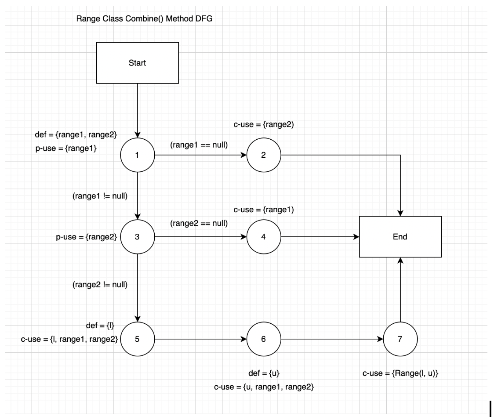
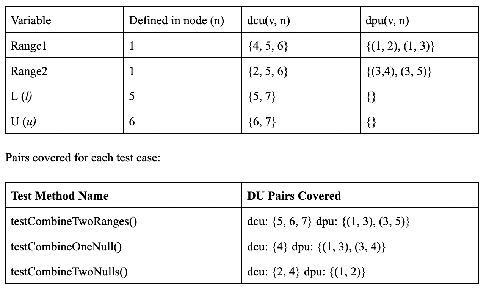
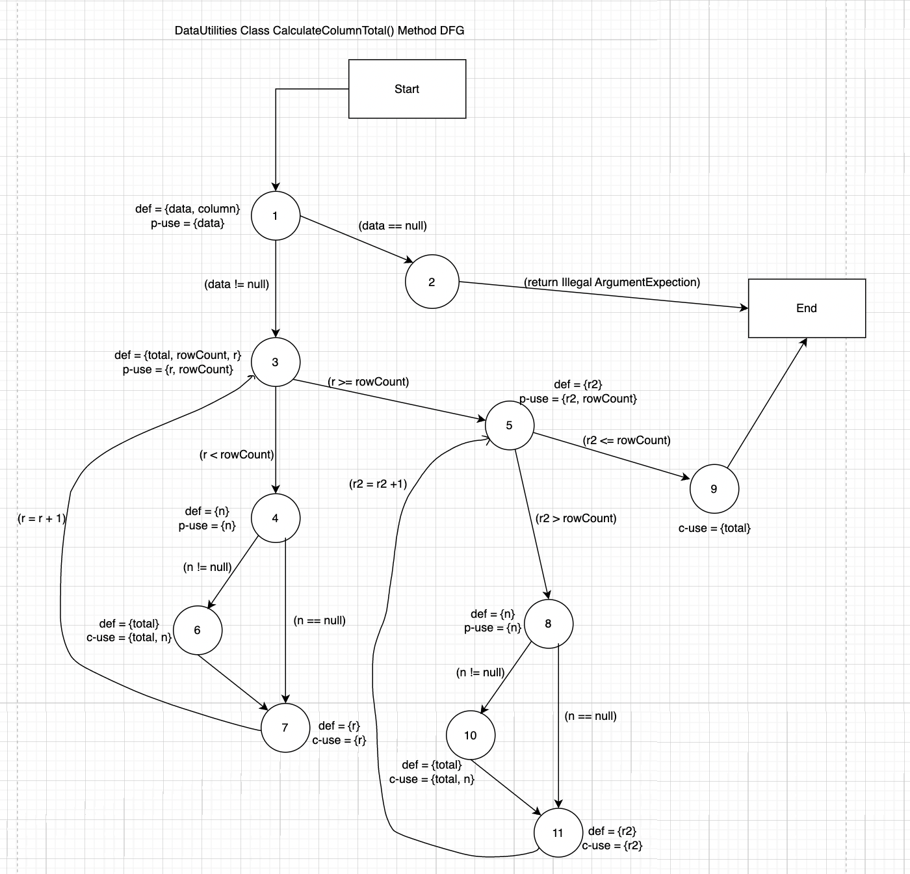
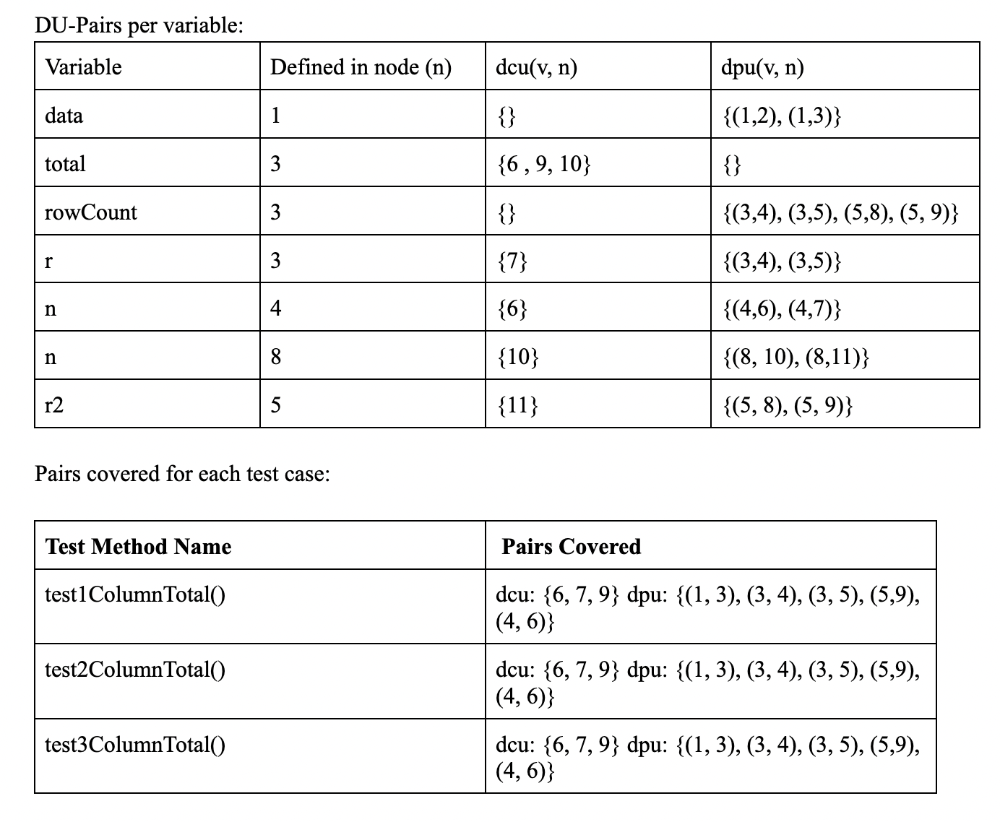
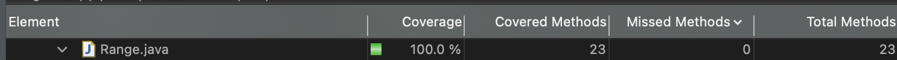
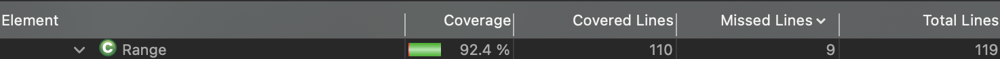
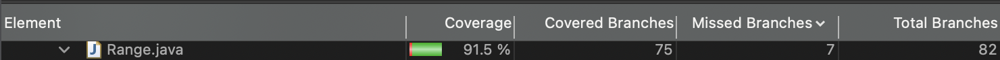
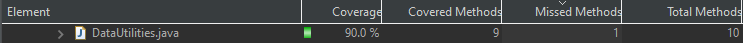
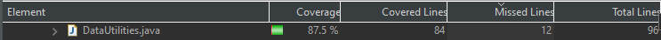
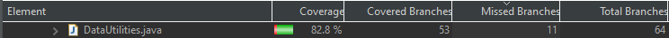

**SENG 438 - Software Testing, Reliability, and Quality**

**Lab. Report #3 – Code Coverage, Adequacy Criteria and Test Case Correlation**

| Group \#:  15    |  UCID   |
| -------------- | --- |
| Student Names: |   |
|   Manraj Singh | 30115660    |
|   Noor Nawaz             |  30118937   |
|   Sajan Hayer             | 30114632    |
|   Ahmad Elshiltawi            |  30123883   |

(Note that some labs require individual reports while others require one report
for each group. Please see each lab document for details.)

# 1 Introduction

This lab's objective was to explore further about White-box testing, and specifically how the JUnit framework along with EclEmma could be used to write unit tests. By using test coverage tools, test writers can understand how in-depth their tests are, by specifically looking at parameters such as Statement Coverage, Branch Coverage and Method/Condition Coverage. By understanding how writing different tests can affect the percentage values of these parameters, the tests we write are more thorough and can expose bugs that may not be covered by writing basic, trivial test cases. By having access to the code of the program, test writes can see how differnt functions return results, and write tests accordingly. White-box testing also allows us to determine more edge cases and edge values that may expose bugs or faulty execution of operations. Furthermore, manually calculating for data-flow coverage and calculating for statement, branch and method coverages allows us to determine how different statements of code affect the flow of data, and the values of those parameters.

# 2 Manual data-flow coverage calculations for X and Y methods

## Range combine() Method data-flow coverage

Data Flow Graph:

Def-use sets per statement:

Def-path set:
- du(1, range1) = {[1], [1,3,4], [1,3,5], [1,3,5,6]}
- du(1, range2) = {[1,2], [1,3], [1,3,5], [1,3,5,6]}
- du(5, l) = {[5,6,7]}
- du(6, u) = {[6,7]}

Def-pair set:
- du(1, 4, range1) = {[1,3,4]}
- du(1, 5, range1) = {[1,3,5]}
- du(1, 6, range1) = {[1,3,5,6]}
- du(1, 2, range2) = {[1,2]}
- du(1, 3, range2) = {[1, 3]}
- du(1, 5, range2) = {[1,3,5]}
- du(1, 6, range2) = {[1,3,5, 6]}
- du(5, 7, l) = {[5,6,7]}
- du(6, 7, u) = {[6, 7]}

Calculate DU-Pair Coverage: CU = 10, PU = 4

## DataUtilities calculateColumnTotal() Method data-flow coverage

Data Flow Graph:

Def-use sets per statement:

Def-path set:
- du(1, data) = {[1]}
- du(3, total) = {[3,4,6], [3,5,9], [3,5,8,10]}
- du(3, rowCount) = {[3],[3,5]}
- du(3, r) = {[3], [3,4,7]}
- du(4, n) = {[4], [4,6]}
- du(5, r2) = {[5], [5,11]}
- du(8, n) = {[8], [8,10]}

Def-pair set:
- du(3, 6, total) = {[3,4,6]}
- du(3, 9, total) = {[3,5,9]}
- du(3, 10, total) = {[3,5,8,10]}
- du(3, 5, rowCount) = {[3,5]}
- du(3, 7, r) = {[3,4,7]}
- du(4, 6, n) = {[4,6]}
- du(5, 11, r2) = {[5,11]}
- du(8, 10, n) = {[8,10]}

Calculate DU-Pair Coverage: CU = 7, PU = 14

# 3 A detailed description of the testing strategy for the new unit test

For the new unit tests, we aim to initially identify the initial statement, branch and condition coverages. After identifying these values, we will write basic test cases for methods that our old code did not test. After we develop these basic tests, we will see the increase in values for the coverages, and add/modify the tests accordingly to improve the values. Furthermore, viewing the initial coverages as a group will allow us to identify where our previous test cases missed statements, and how we could develop further tests to trigger different conditional statements. After this group discussion, we split the two classes amongst two smaller groups (Manraj-Sajan and Noor-Ahmad). Each subgroup took a deeper look at the coverage values provided by EclEmma and split up missed methods to write tests for. After each member was done adding tests, we combined them to see the overall coverage.

Our initial statement, branch and method coverage values (from Assignment 2) were as follows:

Range.combine() method:
- Statement coverage: 11.5%
- Branch coverage: 6.2%
- Condition coverage: 20.0%

DataUtilities.calculateColumnTotal() method:
- Statement coverage: 35.3%
- Branch coverage: 34.1%
- Condition coverage: 43.5%

# 4 A high level description of five selected test cases you have designed using coverage information, and how they have increased code coverage

**Manraj and Sajan:**

**1) public void testEqual4()**

By adding this test case, we aimed to improve the line/statement coverage because this method was not being tested in the intial code from Assignment 2. After conducting this test with valid values, we improved line and method coverage but did not improve branch coverage because the if-statements were not being ran. To improve branch coverage, we modified the values of parameters passed to the equals() method (in class DataUtilities), to provide for null values, and when array sizes and array values were differnt. 

**2) public void test1ColumnTotal()**

These functions changed the coverage values because we removed the mock objects, and replaced them with actual dependent objects. This allowed us to improve the line coverage because EclEmma was not registering the proper coverage values due to the mock objects. After we designed the new test code for test1ColumnTotal(), we developed further test cases by modifying the input values to ensure that all branches were targeted and all lines in the method were targeted.

**3) public void getCumulativePercentageTest2()**

This test improved coverage because the original mock objects were not targeting the test properly. By removing the mock objects and replacing them with actual dependent objects, the coverage increased. We also provided null values for the key-value pairs, and that allowed us to trigger some branch statements that greatly improved branch coverage as they were not being targeted intitially. 

**Noor and Ahmad:**

**4) public static Range shift(Range base, double delta)**

We tested the shift method by creating an example range, shifting it by one, and then verifying that the value returned from getLowerBound() is the same as a value that we hard coded. The shift method did not have any branches, so it was not difficult to increase the coverage of the range class by testing the shift method.

**5) public static Range combine(Range range1, Range range2)**

We tested the combine method by combining two ranges and verifying that the upper and lower bounds of the new range are accurate. We did this by hard coding the expected values and using assertEquals() to ensure they were the same value. We increased the coverage by combining two ranges with numerical values, one range with numerical values and a null range, and then combining two null ranges. This allowed us to increase our branch coverage. 

# 5 A detailed report of the coverage achieved of each class and method (a screen shot from the code cover results in green and red color would suffice)

**Final Coverages:**

Range.java class:
- Statement/Line: 92.4%
- Branch: 91.5%
- Method: 100%

Screenshots:

DataUtilities.java:
- Statement/Line: 87.5%
- Branch: 82.8%
- Method: 90%

Screenshots:

# 6 Pros and Cons of coverage tools used and Metrics you report

EclEmma helped provide important coverage metrics such as Statement, Line and Method coverage. One positive aspect of this tool is the usability and how it is easy to view the coverage metrics for each test case after running it. It also shows in depth for each method in the class being tested the coverage values as well, and how they have been improved after writing tests that target them. Another benefit of this tool is the coverage highlighting, and how it highlights in red the lines and methods that have been missed, in yellow the branches that have been missed and in green the lines/methods that have 100% coverage.

One con of the coverage tool is that it takes some trial and error to identify the coverage metrics and what they mean, along with how to access the differnt metrics. Another con of this tool is how mock objects do not impact the value of coverage metrics. To fix this issue, we had to use actual dependent objects, which may introduce inefficiencis in some cases.

# 7 A comparison on the advantages and disadvantages of requirements-based test generation and coverage-based test generation.

So far in the course, we have learned black-box testing which is similar to requirements-based testing. This allows us to understand the user functional requirements, and develop tests accordingly. Without having the code, we can test core functionality of the program and develop test cases that may violate such functionality. This is an advantage as it allows test designers to focus strictly on functionality and not developing test cases based on code. A disadvantage of this method is that test designers may not develop through test suites as they cannot view coverage metrics.

Coverage-based testing is useful for developing more thorough test cases and test designers can see the code for methods, and identify points where they may fail when provided with different sets of values. It also allows test designers to develop a broader test suite, that tests all lines of a method, including the different paths that data may traverse. This allows us to analyze the data flow in depth, along with how changing variable values may affect operations at a later stage in the data flow. The disadvantage of whitebox testing is that developers may spend a longer time writing tests that may not throughly test the functionality of the system as a whole. In coverage-based testing, specific units are targeted for testing, and the entire system as a whole is not tested in depth. 

# 8 A discussion on how the team work/effort was divided and managed

Initially all group members worked together to determine the intial coverage metrics and understand the aspects that needed to be improved. We all talked about how we could write new test cases that improved the statement, branch and method coverage. After this discussion, we split into two groups (Manraj-Sajan) and (Noor-Ahmad) to indivdually write test cases for the DataUtilities and Range classes. This was done in a pair-programming style so that one member could write code and the other could advise of decisions made. The groups then came together and discussed about the results.

# 9 Any difficulties encountered, challenges overcome, and lessons learned from performing the lab

It was difficult initially to determine how to use EclEmma and what the different parameters meant. This was overcome quickly after group discussion. It was also difficult to understand why mocking was preventing EclEmma from registering the tests, however after changing them to actual objects this issue was fixed.

# 10 Comments/feedback on the lab itself

The lab was useful to see the difference between requirements-based testing and coverage-based, and how each one tests for different things in different ways. The instructions for the lab were clear and concise, however many group members ran into issues while setting up the project in Eclipse. We learned how to develop more through unit tests.
